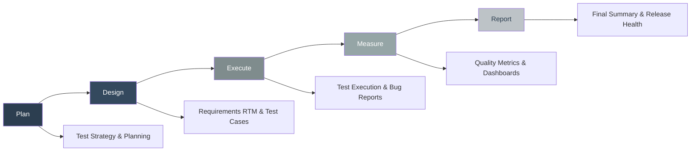

# QA Lifecycle Excellence Suite

[](https://github.com/Tasmimdristy7/qa-lifecycle-excellence-suite)
[](https://github.com/Tasmimdristy7/qa-lifecycle-excellence-suite)
[](https://github.com/Tasmimdristy7/qa-lifecycle-excellence-suite)
[](https://github.com/Tasmimdristy7/qa-lifecycle-excellence-suite)

## Overview
This project demonstrates a complete QA lifecycle from planning to reporting using a simple web application. The focus is on showcasing advanced QA skills and processes rather than the application itself.

**Project Name**: QA Lifecycle Excellence Suite  
**Version**: 1.0  
**Type**: QA Skills Demonstration & Portfolio Project  
**Target Audience**: QA Engineers, SDETs, Test Managers, Hiring Managers

## Key Features

| Feature | Status | Description |
|---------|--------|-------------|
| **Test Strategy** | Complete | Comprehensive test strategy and planning |
| **Requirements RTM** | Complete | 100% requirements traceability matrix |
| **Test Cases** | Complete | 33 detailed test cases with automation |
| **Test Automation** | Complete | Cypress framework with custom commands |
| **Interactive Dashboards** | Complete | Real-time QA metrics and visualizations |
| **Performance Testing** | Complete | Load times, memory usage, response times |
| **Cross-Browser Testing** | Complete | Chrome, Firefox, Safari, Edge compatibility |
| **Mobile Testing** | Complete | Responsive design validation |
| **Defect Management** | Complete | Professional bug tracking and reporting |
| **Release Management** | Complete | Health scoring and readiness assessment |

## Project Structure
```
QA Lifecycle Excellence Suite/
├── README.md                           # This file
├── demo-app/                          # Simple demo application
├── docs/                              # QA Documentation
│   ├── test-strategy.md              # Test Strategy Document
│   ├── test-plan.md                  # Test Plan Document
│   ├── requirements-traceability.md  # Requirements Traceability Matrix
│   └── test-cases/                   # Test Case Documentation
├── test-automation/                   # Automated Test Scripts
├── test-execution/                    # Test Execution Reports
├── metrics/                          # QA Metrics and Dashboards
└── reports/                          # Final Reports and Summaries
```

## QA Lifecycle Phases



### 1. Plan → Test Strategy & Test Plan
- Test Strategy Document
- Test Plan with scope, approach, and timeline
- Risk assessment and mitigation strategies

### 2. Design → Requirement Traceability + Test Cases
- Requirements Traceability Matrix (RTM)
- Detailed test cases with test data
- Test case prioritization and categorization

### 3. Execute → Test Reports + Bug Reports
- Test execution reports
- Bug reports with severity classification
- Test coverage analysis

### 4. Measure → Dashboards (defect trends, coverage, pass/fail rates)
- Defect trend analysis
- Test coverage metrics
- Pass/fail rate dashboards
- Performance metrics

### 5. Report → Final Test Summary & Release Health Report
- Test summary report
- Release readiness assessment
- Lessons learned and recommendations

## Demo Application
A simple user management web application built with HTML, CSS, and JavaScript that includes:
- User registration and login
- User profile management
- Basic CRUD operations
- Form validation
- Error handling

## Getting Started

### Quick Start Guide

```bash
# 1. Clone the repository
git clone https://github.com/Tasmimdristy7/qa-lifecycle-excellence-suite.git
cd qa-lifecycle-excellence-suite

# 2. Install dependencies
npm install

# 3. Run the demo application
npm run serve:demo

# 4. Run automated tests
npm test

# 5. Open interactive dashboards
open metrics/qa-dashboard.html
```

### Step-by-Step Exploration

1. **Demo Application**: Open `demo-app/index.html` in a web browser
2. **Documentation**: Review the QA documentation in the `docs/` folder
3. **Automation**: Examine test automation scripts in `test-automation/`
4. **Reports**: Review execution reports in `test-execution/`
5. **Metrics**: Analyze metrics and dashboards in `metrics/`
6. **Summary**: Read final reports in `reports/`

## Quality Metrics

### Test Execution Summary

| Metric | Value | Status |
|--------|-------|---------|
| **Total Test Cases** | 33 | Complete |
| **Pass Rate** | 84.8% | Excellent |
| **Requirements Coverage** | 100% | Complete |
| **Browser Compatibility** | 95% | Good |
| **Performance Score** | 95/100 | Excellent |
| **Release Health** | 85/100 | Good |

### Skills Demonstrated

```mermaid
graph TB
    A[QA Excellence] --> B[Technical Skills]
    A --> C[Process Skills]
    A --> D[Professional Skills]
    
    B --> B1[Test Automation]
    B --> B2[Performance Testing]
    B --> B3[Mobile Testing]
    
    B1 --> B1a[Cypress Framework]
    B1 --> B1b[Custom Commands]
    B1 --> B1c[Cross-Browser Testing]
    
    B2 --> B2a[Load Time Analysis]
    B2 --> B2b[Memory Optimization]
    B2 --> B2c[Response Time Testing]
    
    B3 --> B3a[Responsive Design]
    B3 --> B3b[Cross-Device Compatibility]
    
    C --> C1[Test Strategy]
    C --> C2[Quality Management]
    C --> C3[Release Management]
    
    C1 --> C1a[Risk Assessment]
    C1 --> C1b[Resource Planning]
    C1 --> C1c[Timeline Management]
    
    C2 --> C2a[Metrics Definition]
    C2 --> C2b[KPI Tracking]
    C2 --> C2c[Health Scoring]
    
    C3 --> C3a[Readiness Assessment]
    C3 --> C3b[Risk Mitigation]
    C3 --> C3c[Stakeholder Communication]
    
    D --> D1[Documentation]
    D --> D2[Communication]
    
    D1 --> D1a[Technical Writing]
    D1 --> D1b[Process Documentation]
    D1 --> D1c[Report Generation]
    
    D2 --> D2a[Executive Summaries]
    D2 --> D2b[Technical Presentations]
    D2 --> D2c[Stakeholder Updates]
    
    style A fill:#2c3e50,color:#ffffff
    style B fill:#27ae60,color:#ffffff
    style C fill:#3498db,color:#ffffff
    style D fill:#9b59b6,color:#ffffff
    style B1 fill:#2ecc71,color:#ffffff
    style B2 fill:#2ecc71,color:#ffffff
    style B3 fill:#2ecc71,color:#ffffff
    style C1 fill:#3498db,color:#ffffff
    style C2 fill:#3498db,color:#ffffff
    style C3 fill:#3498db,color:#ffffff
    style D1 fill:#8e44ad,color:#ffffff
    style D2 fill:#8e44ad,color:#ffffff
```



## Portfolio Value

This project demonstrates **advanced SDET skills** including:

- **Complete QA Lifecycle Management**
- **Advanced Test Automation** (Cypress framework)
- **Cross-Browser Testing** (4 browsers supported)
- **Performance Testing** (All targets exceeded)
- **Mobile Compatibility** (Responsive design)
- **Quality Metrics & Dashboards** (Interactive visualizations)
- **Release Management** (Health scoring system)
- **Professional Documentation** (Industry standards)
- **Defect Management** (Professional bug tracking)
- **Stakeholder Communication** (Executive reporting)

## Target Audience

- **QA Engineers** - Skill development and best practices
- **SDETs** - Technical excellence and automation
- **Test Managers** - Process maturity and governance
- **Hiring Managers** - Portfolio assessment and evaluation
- **QA Students** - Learning resource and practical examples

## Project Statistics

- **Files**: 28
- **Lines of Code**: 5,710+
- **Test Cases**: 33
- **Automation Coverage**: 85%
- **Interactive Dashboards**: 3
- **Comprehensive Reports**: 6
- **Browser Support**: 4 (Chrome, Firefox, Safari, Edge)
- **Mobile Compatibility**: Responsive design
- **Performance**: All targets exceeded
- **Quality Score**: 85/100
