# 🎯 QA Lifecycle Excellence Suite

[](https://github.com/Tasmimdristy7/qa-lifecycle-excellence-suite)
[](https://github.com/Tasmimdristy7/qa-lifecycle-excellence-suite)
[](https://github.com/Tasmimdristy7/qa-lifecycle-excellence-suite)
[](https://github.com/Tasmimdristy7/qa-lifecycle-excellence-suite)

## 🎯 Overview
This project demonstrates a complete QA lifecycle from planning to reporting using a simple web application. The focus is on showcasing advanced QA skills and processes rather than the application itself.

**Project Name**: QA Lifecycle Excellence Suite  
**Version**: 1.0  
**Type**: QA Skills Demonstration & Portfolio Project  
**Target Audience**: QA Engineers, SDETs, Test Managers, Hiring Managers

## 🏆 Key Features

| Feature | Status | Description |
|---------|--------|-------------|
| 📋 **Test Strategy** | ✅ Complete | Comprehensive test strategy and planning |
| 🔍 **Requirements RTM** | ✅ Complete | 100% requirements traceability matrix |
| 🧪 **Test Cases** | ✅ Complete | 33 detailed test cases with automation |
| 🤖 **Test Automation** | ✅ Complete | Cypress framework with custom commands |
| 📊 **Interactive Dashboards** | ✅ Complete | Real-time QA metrics and visualizations |
| 📈 **Performance Testing** | ✅ Complete | Load times, memory usage, response times |
| 🌐 **Cross-Browser Testing** | ✅ Complete | Chrome, Firefox, Safari, Edge compatibility |
| 📱 **Mobile Testing** | ✅ Complete | Responsive design validation |
| 🐛 **Defect Management** | ✅ Complete | Professional bug tracking and reporting |
| 🚀 **Release Management** | ✅ Complete | Health scoring and readiness assessment |

## Project Structure
```
QA Lifecycle Excellence Suite/
├── README.md                           # This file
├── demo-app/                          # Simple demo application
├── docs/                              # QA Documentation
│   ├── test-strategy.md              # Test Strategy Document
│   ├── test-plan.md                  # Test Plan Document
│   ├── requirements-traceability.md  # Requirements Traceability Matrix
│   └── test-cases/                   # Test Case Documentation
├── test-automation/                   # Automated Test Scripts
├── test-execution/                    # Test Execution Reports
├── metrics/                          # QA Metrics and Dashboards
└── reports/                          # Final Reports and Summaries
```

## 🔄 QA Lifecycle Phases

```mermaid
graph LR
    A[📋 Plan] --> B[🔍 Design]
    B --> C[⚡ Execute]
    C --> D[📊 Measure]
    D --> E[📋 Report]
    
    A --> A1[Test Strategy & Planning]
    B --> B1[Requirements RTM & Test Cases]
    C --> C1[Test Execution & Bug Reports]
    D --> D1[Quality Metrics & Dashboards]
    E --> E1[Final Summary & Release Health]
    
    style A fill:#e3f2fd
    style B fill:#f3e5f5
    style C fill:#e8f5e8
    style D fill:#fff3e0
    style E fill:#fce4ec
```



### 1. 📋 Plan → Test Strategy & Test Plan
- ✅ Test Strategy Document
- ✅ Test Plan with scope, approach, and timeline
- ✅ Risk assessment and mitigation strategies

### 2. 🔍 Design → Requirement Traceability + Test Cases
- ✅ Requirements Traceability Matrix (RTM)
- ✅ Detailed test cases with test data
- ✅ Test case prioritization and categorization

### 3. ⚡ Execute → Test Reports + Bug Reports
- ✅ Test execution reports
- ✅ Bug reports with severity classification
- ✅ Test coverage analysis

### 4. 📊 Measure → Dashboards (defect trends, coverage, pass/fail rates)
- ✅ Defect trend analysis
- ✅ Test coverage metrics
- ✅ Pass/fail rate dashboards
- ✅ Performance metrics

### 5. 📋 Report → Final Test Summary & Release Health Report
- ✅ Test summary report
- ✅ Release readiness assessment
- ✅ Lessons learned and recommendations

## Demo Application
A simple user management web application built with HTML, CSS, and JavaScript that includes:
- User registration and login
- User profile management
- Basic CRUD operations
- Form validation
- Error handling

## 🚀 Getting Started

### Quick Start Guide

```bash
# 1. Clone the repository
git clone https://github.com/Tasmimdristy7/qa-lifecycle-excellence-suite.git
cd qa-lifecycle-excellence-suite

# 2. Install dependencies
npm install

# 3. Run the demo application
npm run serve:demo

# 4. Run automated tests
npm test

# 5. Open interactive dashboards
open metrics/qa-dashboard.html
```

### 📋 Step-by-Step Exploration

1. **🎮 Demo Application**: Open `demo-app/index.html` in a web browser
2. **📚 Documentation**: Review the QA documentation in the `docs/` folder
3. **🤖 Automation**: Examine test automation scripts in `test-automation/`
4. **📊 Reports**: Review execution reports in `test-execution/`
5. **📈 Metrics**: Analyze metrics and dashboards in `metrics/`
6. **📋 Summary**: Read final reports in `reports/`

## 📊 Quality Metrics

### Test Execution Summary

| Metric | Value | Status |
|--------|-------|---------|
| **Total Test Cases** | 33 | ✅ |
| **Pass Rate** | 84.8% | ✅ |
| **Requirements Coverage** | 100% | ✅ |
| **Browser Compatibility** | 95% | ✅ |
| **Performance Score** | 95/100 | ✅ |
| **Release Health** | 85/100 | ✅ |

### 🎯 Skills Demonstrated


## 🏆 Portfolio Value

This project demonstrates **advanced SDET skills** including:

- ✅ **Complete QA Lifecycle Management**
- ✅ **Advanced Test Automation** (Cypress framework)
- ✅ **Cross-Browser Testing** (4 browsers supported)
- ✅ **Performance Testing** (All targets exceeded)
- ✅ **Mobile Compatibility** (Responsive design)
- ✅ **Quality Metrics & Dashboards** (Interactive visualizations)
- ✅ **Release Management** (Health scoring system)
- ✅ **Professional Documentation** (Industry standards)
- ✅ **Defect Management** (Professional bug tracking)
- ✅ **Stakeholder Communication** (Executive reporting)

## 🎯 Target Audience

- **QA Engineers** - Skill development and best practices
- **SDETs** - Technical excellence and automation
- **Test Managers** - Process maturity and governance
- **Hiring Managers** - Portfolio assessment and evaluation
- **QA Students** - Learning resource and practical examples

## 📈 Project Statistics

- **📁 Files**: 28
- **📝 Lines of Code**: 5,710+
- **🧪 Test Cases**: 33
- **🤖 Automation Coverage**: 85%
- **📊 Interactive Dashboards**: 3
- **📋 Comprehensive Reports**: 6
- **🌐 Browser Support**: 4 (Chrome, Firefox, Safari, Edge)
- **📱 Mobile Compatibility**: Responsive design
- **⚡ Performance**: All targets exceeded
- **🎯 Quality Score**: 85/100
