# QA Lifecycle Process Flow

## Visual Process Flow Diagram

```mermaid
graph TD
    A[📋 Test Strategy] --> B[📝 Test Planning]
    B --> C[🔍 Requirements Analysis]
    C --> D[📊 RTM Creation]
    D --> E[🧪 Test Case Design]
    E --> F[🤖 Test Automation]
    F --> G[⚡ Test Execution]
    G --> H[📈 Metrics Collection]
    H --> I[🐛 Defect Management]
    I --> J[📊 Quality Assessment]
    J --> K[🚀 Release Decision]
    K --> L[📋 Final Reporting]
    
    style A fill:#e1f5fe
    style B fill:#f3e5f5
    style C fill:#e8f5e8
    style D fill:#fff3e0
    style E fill:#fce4ec
    style F fill:#f1f8e9
    style G fill:#e3f2fd
    style H fill:#fff8e1
    style I fill:#ffebee
    style J fill:#e8f5e8
    style K fill:#e1f5fe
    style L fill:#f3e5f5
```

## QA Skills Matrix

## Test Coverage Visualization

## Defect Severity Distribution

## Browser Compatibility Matrix

```mermaid
graph LR
    A[🌐 Web Application] --> B[Chrome 120.0]
    A --> C[Firefox 121.0]
    A --> D[Safari 17.0]
    A --> E[Edge 120.0]
    
    B --> B1[✅ 100% Compatible]
    C --> C1[✅ 100% Compatible]
    D --> D1[⚠️ 85.7% Compatible]
    E --> E1[✅ 100% Compatible]
    
    style B1 fill:#c8e6c9
    style C1 fill:#c8e6c9
    style D1 fill:#fff3e0
    style E1 fill:#c8e6c9
```

## Performance Metrics Dashboard

```mermaid
graph TD
    A[📊 Performance Metrics] --> B[Page Load Time]
    A --> C[Form Submission]
    A --> D[Validation Response]
    A --> E[Memory Usage]
    
    B --> B1[Target: <3s<br/>Actual: 1.2s ✅]
    C --> C1[Target: <1s<br/>Actual: 0.3s ✅]
    D --> D1[Target: <0.5s<br/>Actual: 0.1s ✅]
    E --> E1[Target: <100MB<br/>Actual: 45MB ✅]
    
    style B1 fill:#c8e6c9
    style C1 fill:#c8e6c9
    style D1 fill:#c8e6c9
    style E1 fill:#c8e6c9
```

## Release Health Score

```mermaid
graph LR
    A[🎯 Release Health Score: 85/100] --> B[Quality: 85/100]
    A --> C[Performance: 95/100]
    A --> D[Compatibility: 90/100]
    A --> E[Security: 80/100]
    A --> F[Usability: 90/100]
    
    style A fill:#e1f5fe
    style B fill:#fff3e0
    style C fill:#c8e6c9
    style D fill:#c8e6c9
    style E fill:#fff3e0
    style F fill:#c8e6c9
```

