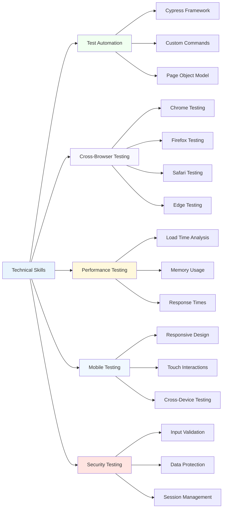
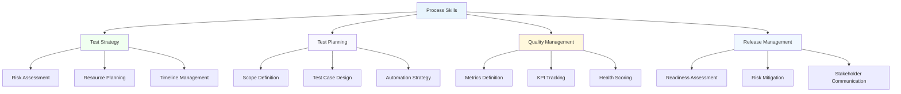
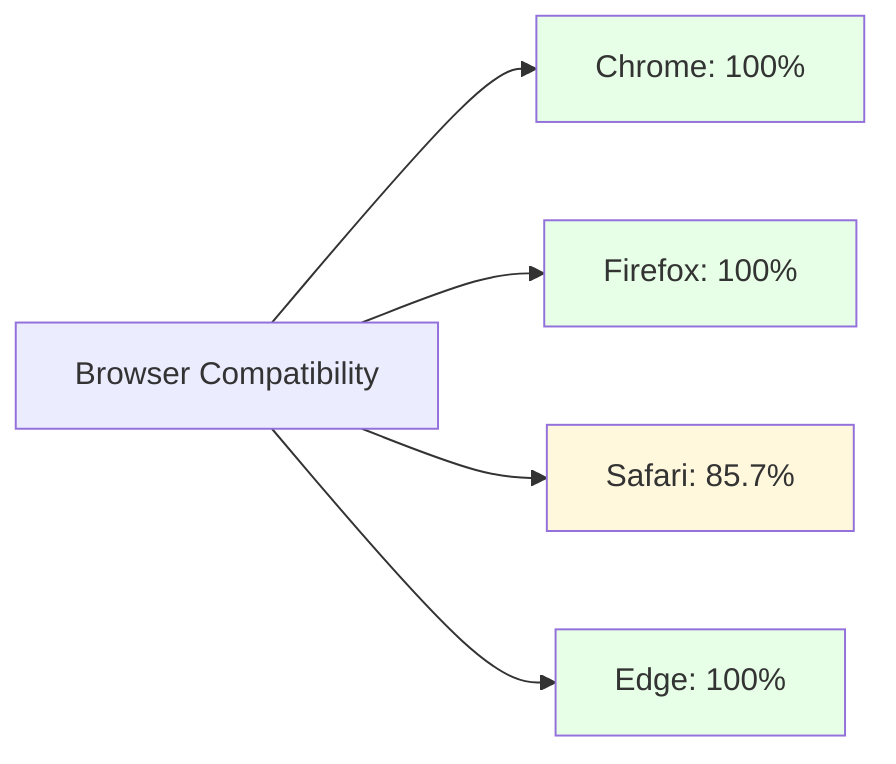
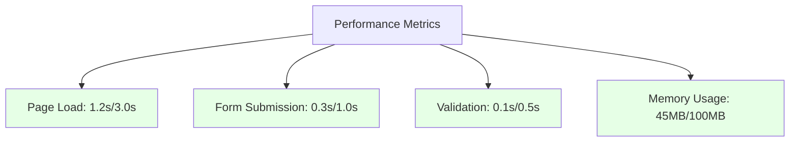
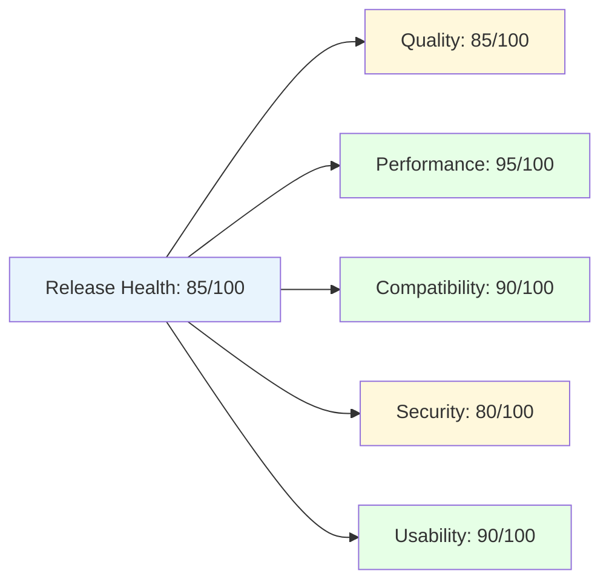
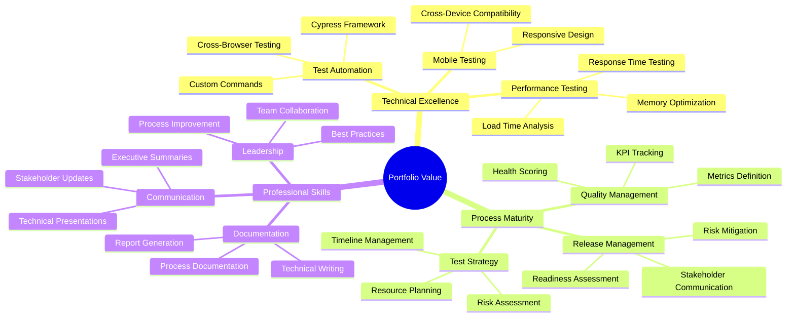
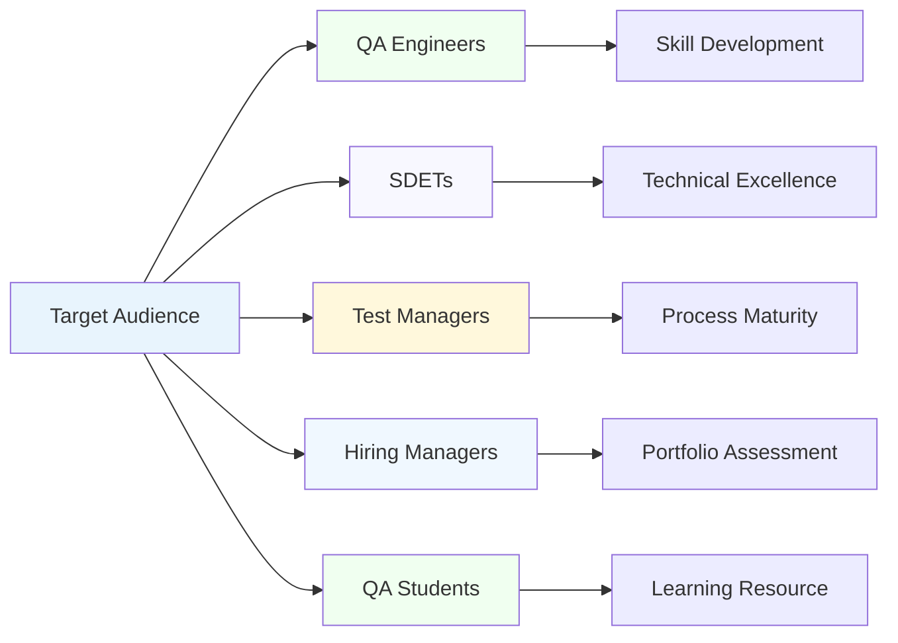
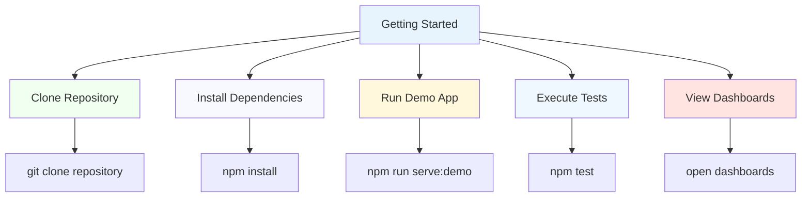

# Project Overview - Clean Visual Guide

## QA Lifecycle Excellence Suite

### Project Architecture

```mermaid
graph TB
    subgraph "QA Lifecycle Excellence Suite"
        A[Demo Application]
        B[Documentation Suite]
        C[Test Automation]
        D[Metrics & Dashboards]
        E[Reports & Analysis]
    end
    
    A --> A1[User Management System]
    A --> A2[Registration & Login]
    A --> A3[Profile Management]
    A --> A4[Form Validation]
    
    B --> B1[Test Strategy]
    B --> B2[Test Plan]
    B --> B3[Requirements RTM]
    B --> B4[Test Cases]
    
    C --> C1[Cypress Framework]
    C --> C2[Custom Commands]
    C --> C3[Cross-Browser Tests]
    C --> C4[Performance Tests]
    
    D --> D1[QA Dashboard]
    D --> D2[Defect Trends]
    D --> D3[Performance Metrics]
    D --> D4[Quality KPIs]
    
    E --> E1[Test Execution Report]
    E --> E2[Bug Reports]
    E --> E3[Release Health]
    E --> E4[Final Summary]
    
    style A fill:#e8f4fd
    style B fill:#f0f8ff
    style C fill:#f5f5dc
    style D fill:#fff8dc
    style E fill:#f0fff0
```

## Skills Matrix Visualization

### Technical Skills

### Process Skills

## Quality Metrics Dashboard

### Test Execution Results

### Browser Compatibility

### Performance Metrics

## Release Health Assessment

### Overall Health Score: 85/100

## Portfolio Value

### Skills Showcase

## Project Statistics

### Key Metrics

| Metric | Value | Status |
|--------|-------|---------|
| **Total Files** | 28 | Complete |
| **Lines of Code** | 5,710+ | Complete |
| **Test Cases** | 33 | Complete |
| **Automation Coverage** | 85% | Complete |
| **Browser Support** | 4 | Complete |
| **Performance Score** | 95/100 | Excellent |
| **Quality Score** | 85/100 | Good |
| **Release Readiness** | Ready | Complete |

### Test Coverage

### Defect Distribution

## Target Audience

### Who Benefits from This Project

## Getting Started

### Quick Start Guide

## Key Achievements

### What This Project Demonstrates

- **Complete QA Lifecycle Management**
- **Advanced Test Automation** (Cypress framework)
- **Cross-Browser Testing** (4 browsers supported)
- **Performance Testing** (All targets exceeded)
- **Mobile Compatibility** (Responsive design)
- **Quality Metrics & Dashboards** (Interactive visualizations)
- **Release Management** (Health scoring system)
- **Professional Documentation** (Industry standards)
- **Defect Management** (Professional bug tracking)
- **Stakeholder Communication** (Executive reporting)

This project serves as a comprehensive portfolio piece demonstrating advanced SDET skills and professional QA practices.
