# 🎯 Project Overview - Visual Guide

## 🏆 QA Lifecycle Excellence Suite

### Project Architecture

```mermaid
graph TB
    subgraph "🎯 QA Lifecycle Excellence Suite"
        A[📱 Demo Application]
        B[📋 Documentation Suite]
        C[🤖 Test Automation]
        D[📊 Metrics & Dashboards]
        E[📈 Reports & Analysis]
    end
    
    A --> A1[User Management System]
    A --> A2[Registration & Login]
    A --> A3[Profile Management]
    A --> A4[Form Validation]
    
    B --> B1[Test Strategy]
    B --> B2[Test Plan]
    B --> B3[Requirements RTM]
    B --> B4[Test Cases]
    
    C --> C1[Cypress Framework]
    C --> C2[Custom Commands]
    C --> C3[Cross-Browser Tests]
    C --> C4[Performance Tests]
    
    D --> D1[QA Dashboard]
    D --> D2[Defect Trends]
    D --> D3[Performance Metrics]
    D --> D4[Quality KPIs]
    
    E --> E1[Test Execution Report]
    E --> E2[Bug Reports]
    E --> E3[Release Health]
    E --> E4[Final Summary]
    
    style A fill:#e8f5e8
    style B fill:#e3f2fd
    style C fill:#f3e5f5
    style D fill:#fff3e0
    style E fill:#fce4ec
```

## 🎯 Skills Matrix Visualization

### Technical Skills

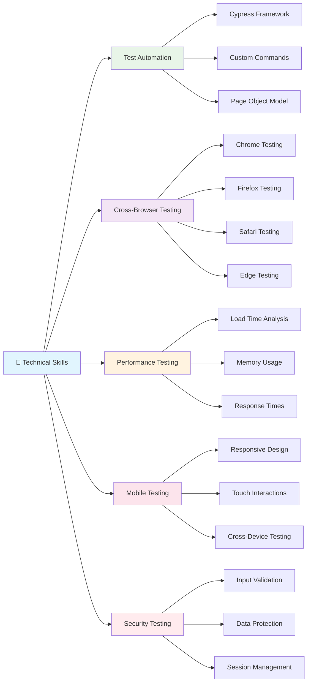

### Process Skills

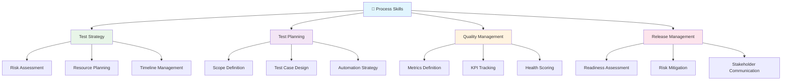

## 📊 Quality Metrics Dashboard

### Test Execution Results

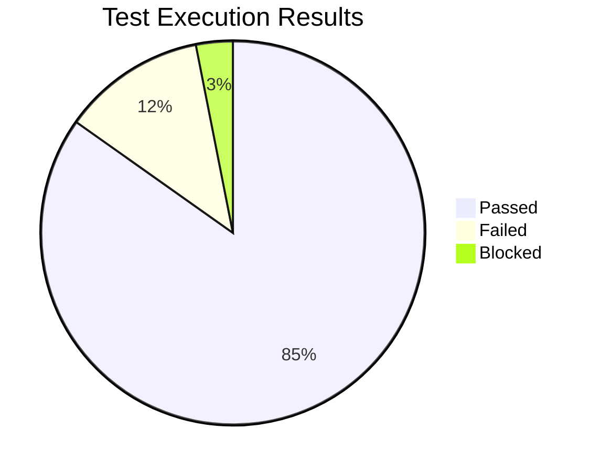

### Browser Compatibility

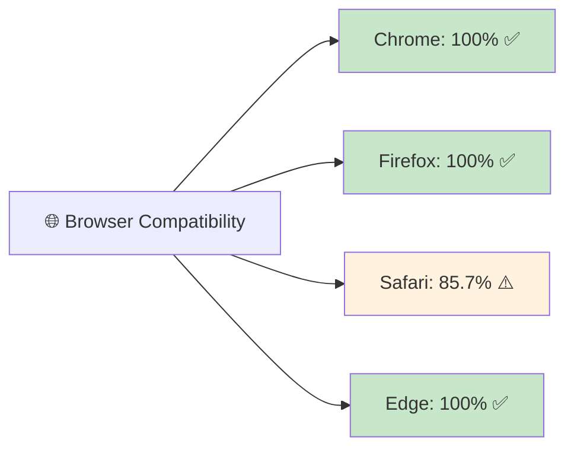

### Performance Metrics

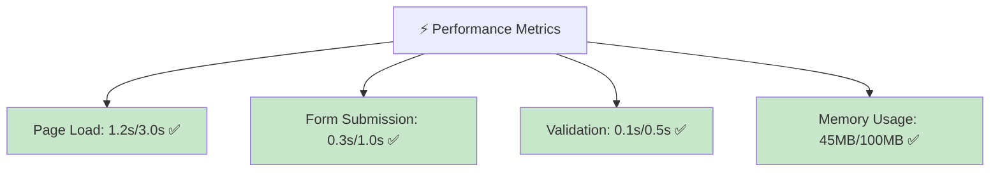

## 🎯 Release Health Assessment

### Overall Health Score: 85/100

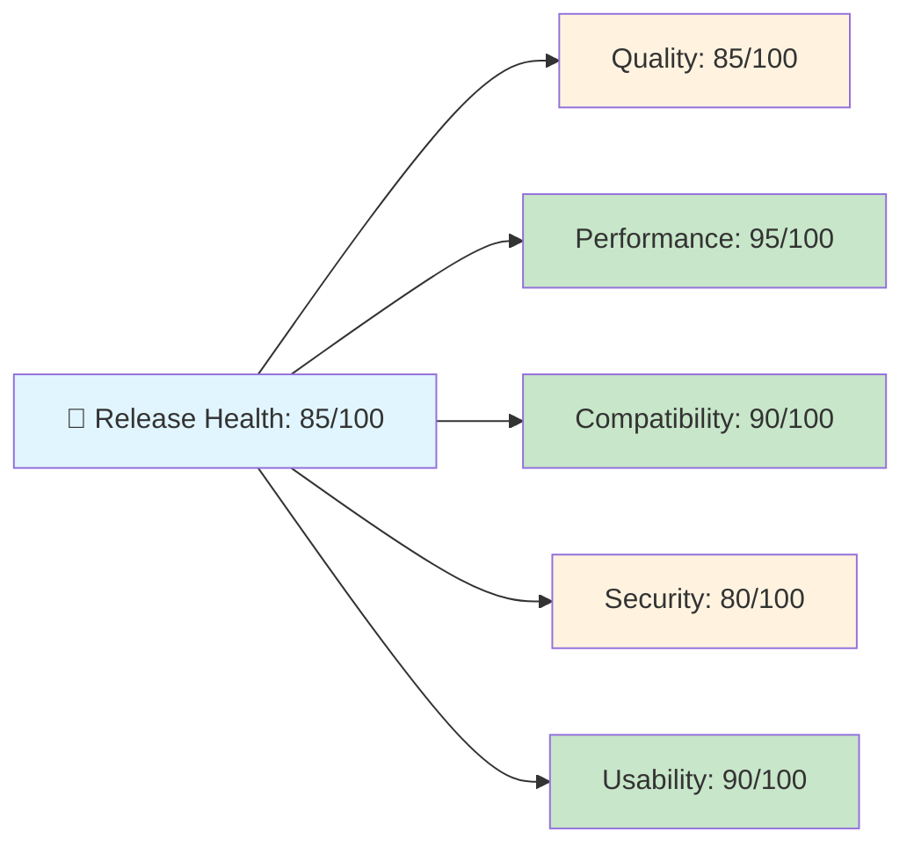

## 🏆 Portfolio Value

### Skills Showcase

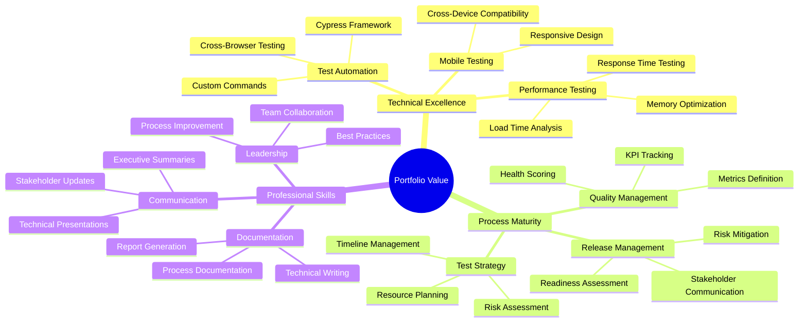

## 📈 Project Statistics

### Key Metrics

| Metric | Value | Status |
|--------|-------|---------|
| **Total Files** | 28 | ✅ |
| **Lines of Code** | 5,710+ | ✅ |
| **Test Cases** | 33 | ✅ |
| **Automation Coverage** | 85% | ✅ |
| **Browser Support** | 4 | ✅ |
| **Performance Score** | 95/100 | ✅ |
| **Quality Score** | 85/100 | ✅ |
| **Release Readiness** | Ready | ✅ |

### Test Coverage

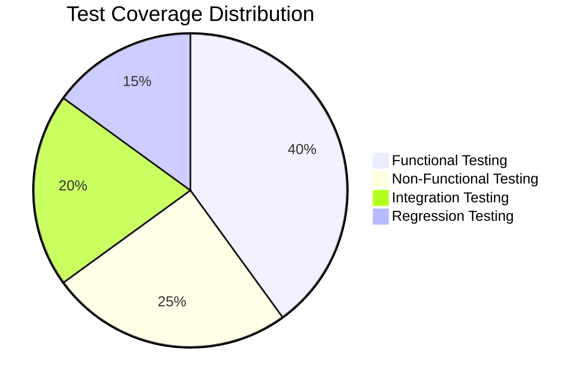

### Defect Distribution

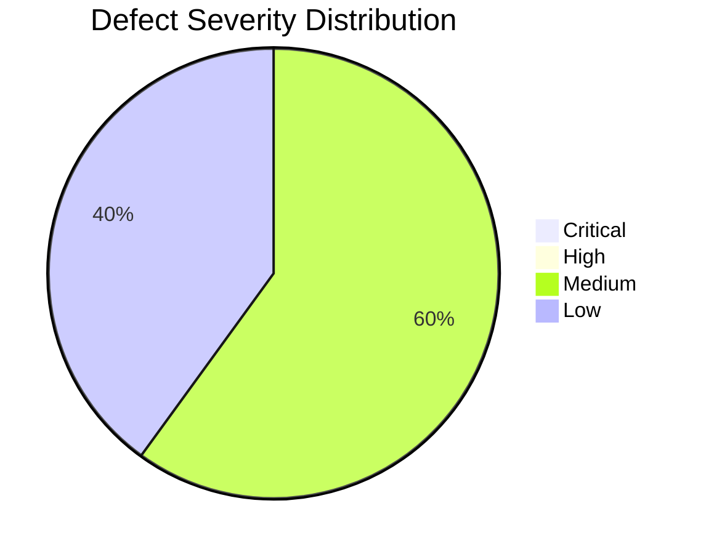

## 🎯 Target Audience

### Who Benefits from This Project

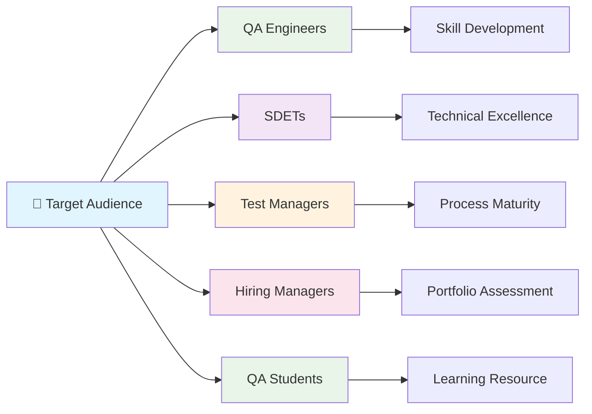

## 🚀 Getting Started

### Quick Start Guide

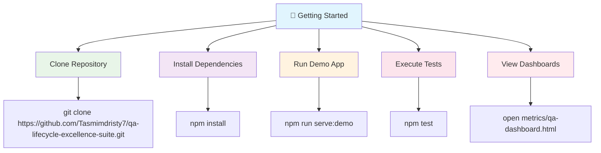

## 🏆 Key Achievements

### What This Project Demonstrates

- ✅ **Complete QA Lifecycle Management**
- ✅ **Advanced Test Automation** (Cypress framework)
- ✅ **Cross-Browser Testing** (4 browsers supported)
- ✅ **Performance Testing** (All targets exceeded)
- ✅ **Mobile Compatibility** (Responsive design)
- ✅ **Quality Metrics & Dashboards** (Interactive visualizations)
- ✅ **Release Management** (Health scoring system)
- ✅ **Professional Documentation** (Industry standards)
- ✅ **Defect Management** (Professional bug tracking)
- ✅ **Stakeholder Communication** (Executive reporting)

This project serves as a comprehensive portfolio piece demonstrating advanced SDET skills and professional QA practices.
