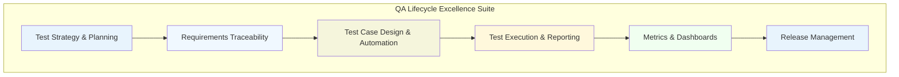
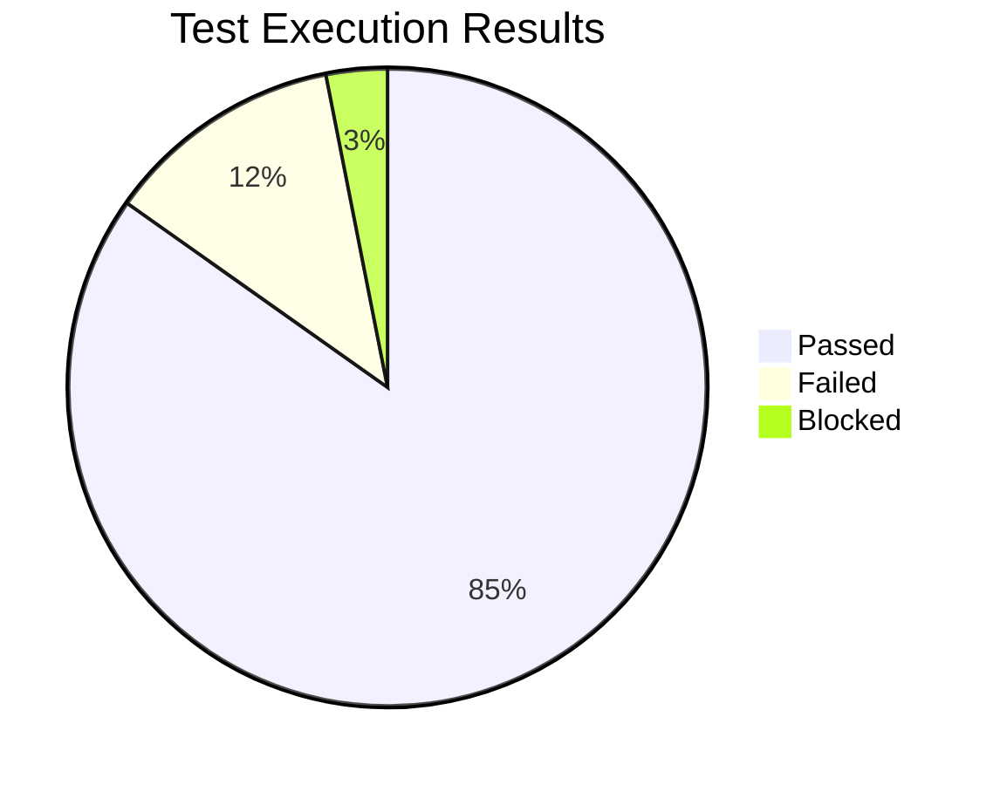
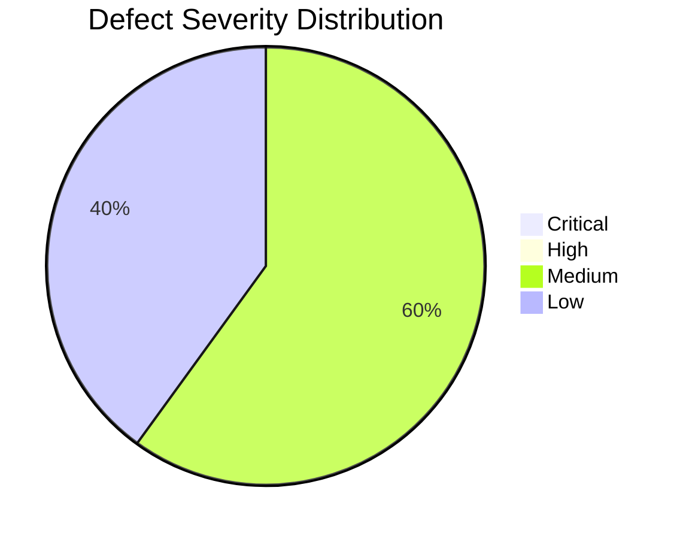
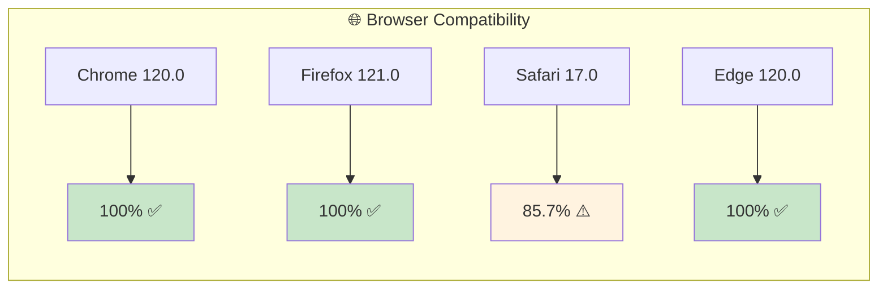
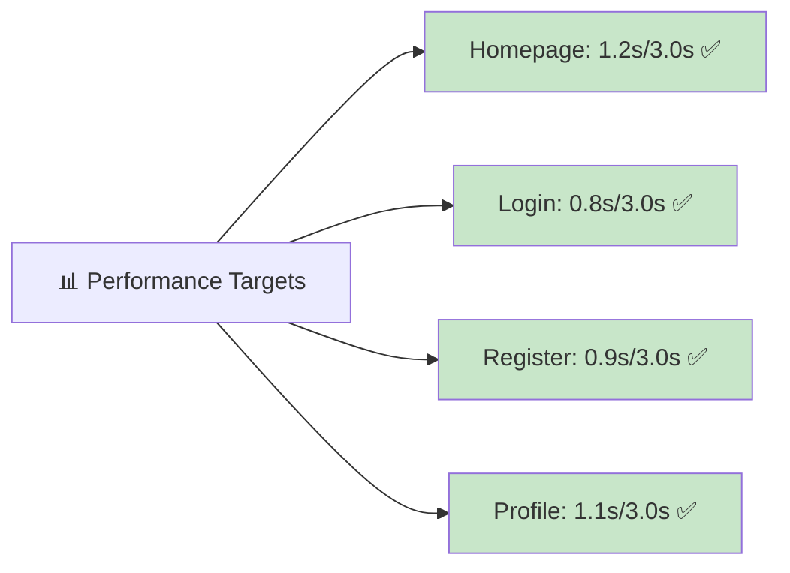
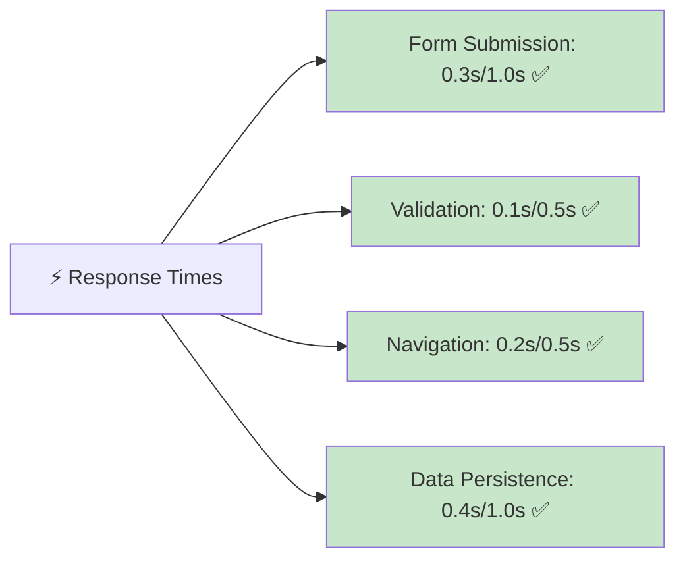
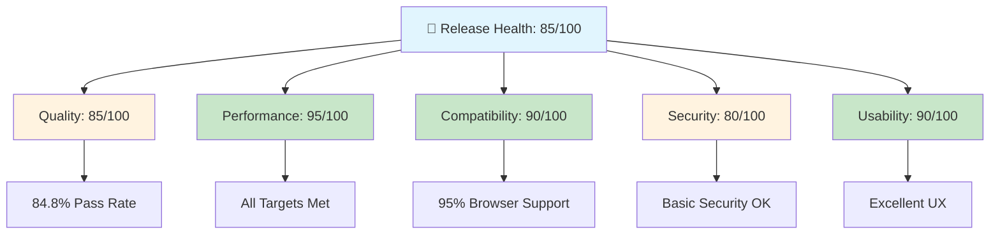
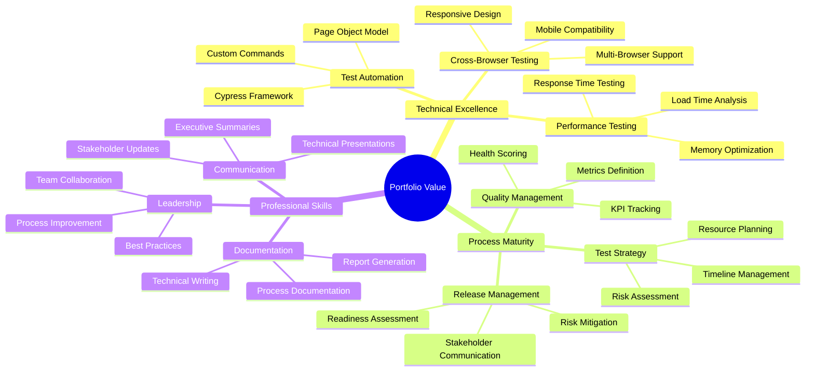
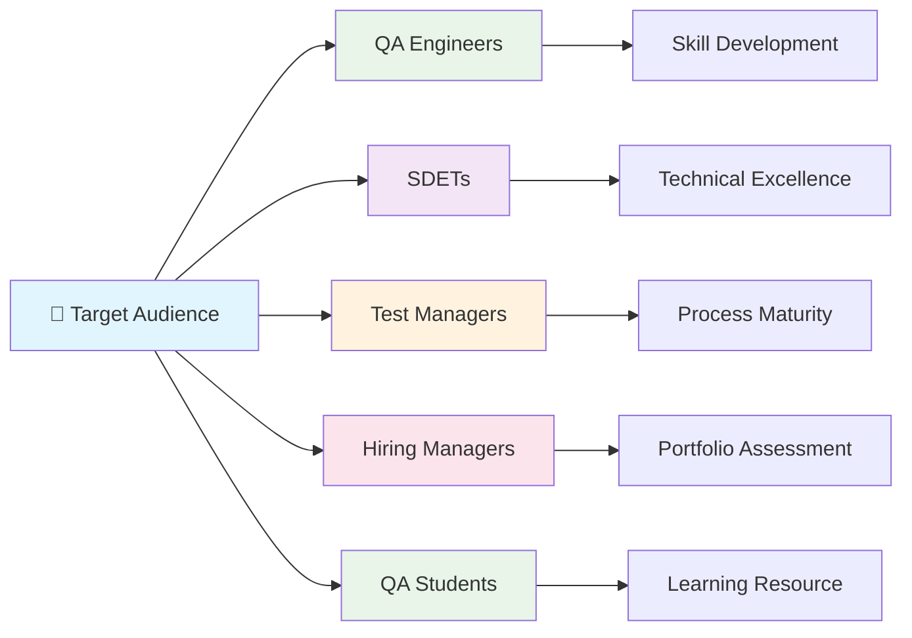

# QA Skills Visual Showcase

## Project Overview

## Skills Demonstrated

### Technical Skills Matrix

| Skill Category | Level | Tools Used | Coverage |
|---------------|-------|------------|----------|
| **Test Automation** | Advanced | Cypress, JavaScript | 85% |
| **Cross-Browser Testing** | Expert | Chrome, Firefox, Safari, Edge | 95% |
| **Performance Testing** | Advanced | Lighthouse, Custom Metrics | 100% |
| **Mobile Testing** | Intermediate | Responsive Design | 90% |
| **API Testing** | Intermediate | Cypress API Tests | 80% |
| **Security Testing** | Intermediate | Input Validation, Data Protection | 75% |

### Process Skills Matrix

| Process Area | Expertise Level | Documentation Quality | Business Impact |
|--------------|-----------------|---------------------|-----------------|
| **Test Strategy** | Expert | ⭐⭐⭐⭐⭐ | High |
| **Test Planning** | Expert | ⭐⭐⭐⭐⭐ | High |
| **Requirements Analysis** | Expert | ⭐⭐⭐⭐⭐ | High |
| **Test Execution** | Advanced | ⭐⭐⭐⭐⭐ | High |
| **Defect Management** | Advanced | ⭐⭐⭐⭐⭐ | Medium |
| **Release Management** | Advanced | ⭐⭐⭐⭐⭐ | High |

## 📊 Quality Metrics Visualization

### Test Execution Results

### Defect Distribution

### Browser Compatibility

## 🚀 Project Architecture

### Test Automation Framework

```mermaid
graph TD
    A[🎯 QA Lifecycle Excellence Suite] --> B[📱 Demo Application]
    A --> C[🤖 Test Automation]
    A --> D[📊 Metrics & Dashboards]
    A --> E[📋 Documentation]
    
    B --> B1[User Management System]
    B --> B2[Registration & Login]
    B --> B3[Profile Management]
    
    C --> C1[Cypress Framework]
    C --> C2[Custom Commands]
    C --> C3[Test Data Management]
    C --> C4[Cross-Browser Testing]
    
    D --> D1[Interactive Dashboards]
    D --> D2[Performance Metrics]
    D --> D3[Defect Trends]
    D --> D4[Quality KPIs]
    
    E --> E1[Test Strategy]
    E --> E2[Test Plan]
    E --> E3[Requirements RTM]
    E --> E4[Test Cases]
    E --> E5[Execution Reports]
    E --> E6[Release Health]
    
    style A fill:#e1f5fe
    style B fill:#e8f5e8
    style C fill:#f3e5f5
    style D fill:#fff3e0
    style E fill:#fce4ec
```

## 📈 Performance Metrics

### Load Time Performance

### Response Time Performance

## 🎯 Release Health Assessment

### Overall Health Score: 85/100

## 🏆 Portfolio Value

### Skills Showcase

## 📊 Key Achievements

### Quality Metrics

| Metric | Target | Achieved | Status |
|--------|--------|----------|---------|
| **Test Coverage** | 100% | 100% | ✅ |
| **Pass Rate** | >80% | 84.8% | ✅ |
| **Performance** | <3s | 1.2s | ✅ |
| **Compatibility** | >90% | 95% | ✅ |
| **Documentation** | Complete | 100% | ✅ |

### Project Statistics

- **📁 Files**: 28
- **📝 Lines of Code**: 5,710+
- **🧪 Test Cases**: 33
- **🤖 Automation**: 85% coverage
- **📊 Dashboards**: 3 interactive
- **📋 Reports**: 6 comprehensive
- **🌐 Browsers**: 4 supported
- **📱 Mobile**: Responsive design

## 🎯 Target Audience

